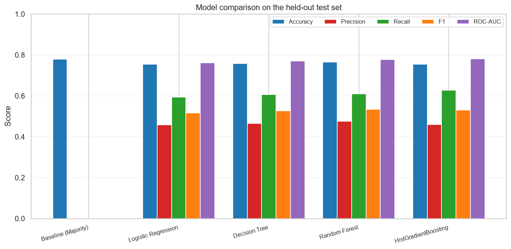
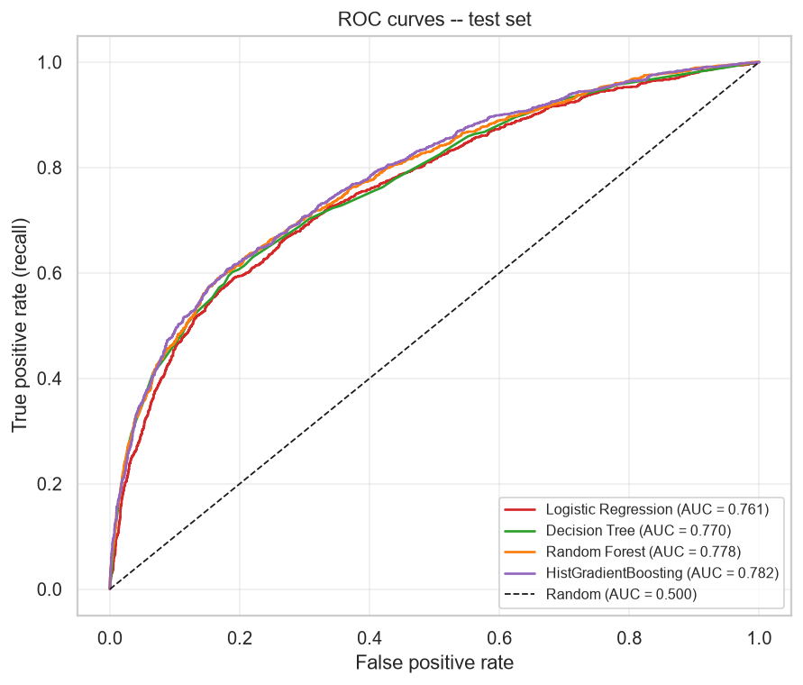
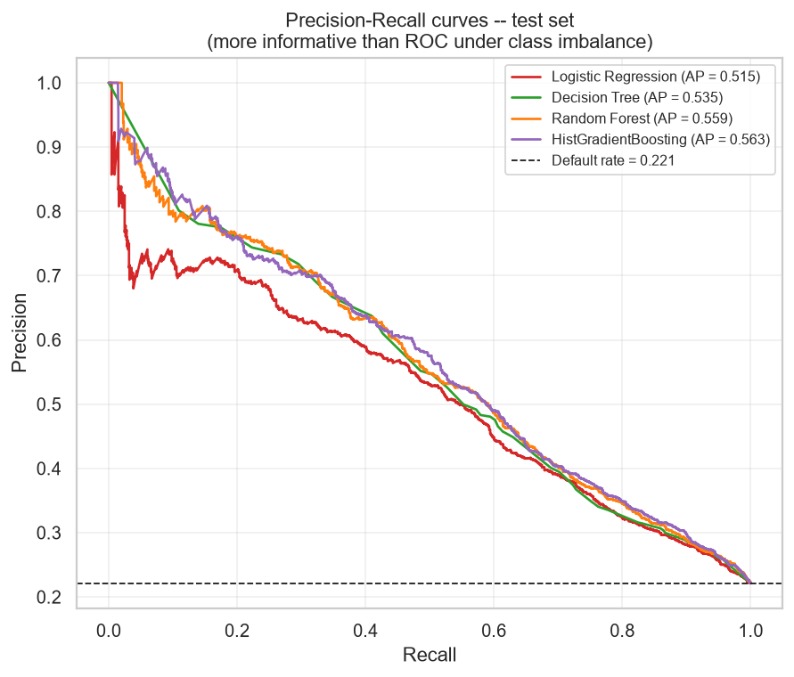
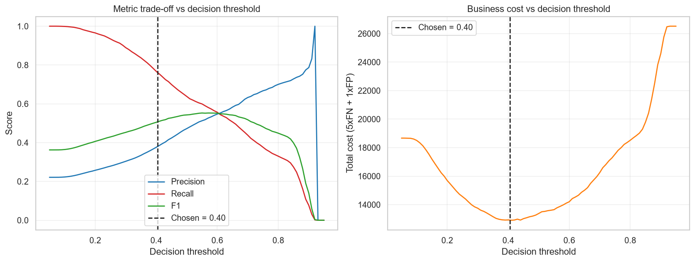
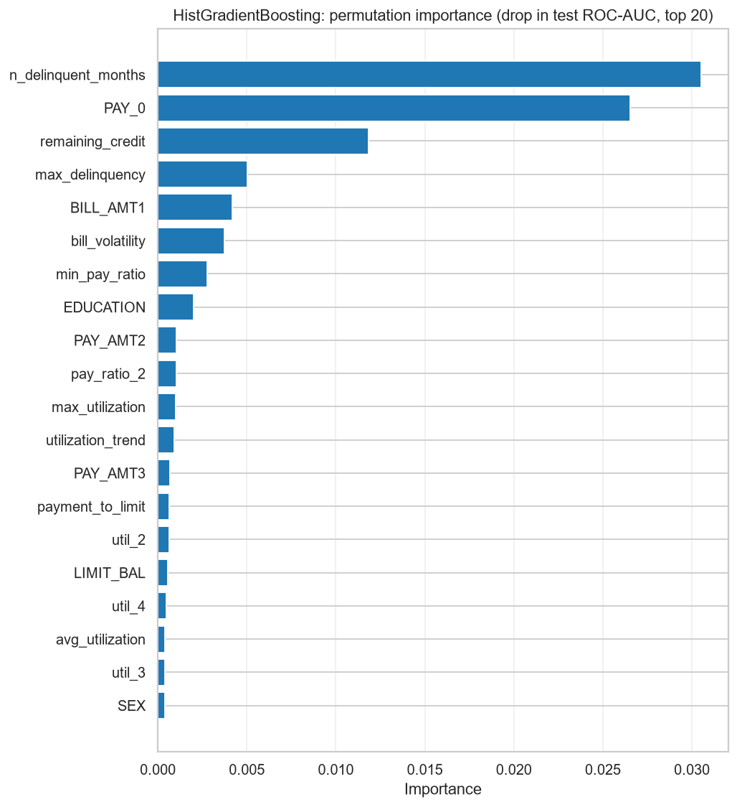

<div align="center">

# Credit Scoring Model

### Predicting creditworthiness from real financial history

Machine-learning system that estimates the probability a credit-card customer will
**default on their next payment**, trained on 29,965 real customers with six months of
billing, payment and delinquency history.

[](https://www.python.org/)
[](https://scikit-learn.org/)
[](https://flask.palletsprojects.com/)
[](tests/verify_pipeline.py)
[](#results)
[](https://archive.ics.uci.edu/dataset/350/default+of+credit+card+clients)

</div>

---

## The headline

> A model that predicts **"nobody defaults"** scores **77.87% accuracy** on this
> dataset — beating three of the four real models — while catching **zero** defaulters.
>
> **That is why this project is not judged on accuracy.**

The final model is selected on **ROC-AUC** (ranking quality), then its decision
threshold is tuned for **recall**, because approving a customer who defaults costs a
lender far more than declining one who would have repaid.

| | Result |
|---|---|
| **Final model** | `HistGradientBoostingClassifier` |
| **Test ROC-AUC** | **0.7818** (CV 0.7899) |
| **Recall at the tuned threshold** | **74.8%** — catches 992 of 1,326 defaulters |
| **Top risk driver** | `n_delinquent_months` — an *engineered* feature |
| **Total pipeline runtime** | 1,356 s, exit code 0 |

<div align="center">
  
</div>

---

## Contents

- [Quickstart](#quickstart)
- [Interactive dashboard](#interactive-dashboard)
- [The problem](#the-problem)
- [Dataset](#dataset)
- [Methodology](#methodology)
- [Results](#results)
- [What drives credit risk](#what-drives-credit-risk)
- [Error analysis](#error-analysis)
- [Fairness](#fairness)
- [Limitations](#limitations)
- [Project structure](#project-structure)
- [Reproducibility](#reproducibility)

---

## Quickstart

```bash
pip install -r requirements.txt
```

```bash
python -m src.train
```

Downloads the dataset, runs EDA, engineers features, trains and tunes every model, and
writes all figures, tables and the saved model. **~20–30 minutes.**

```bash
python -m src.webapp
```

Opens the interactive dashboard at **http://127.0.0.1:5000**.

<details>
<summary><b>More commands</b></summary>

```bash
python -m src.train --quick
```
Identical code path on a 4,000-row subsample with smaller searches (~2 min). For
smoke-testing only — **not** reportable results.

```bash
python -m src.predict
```
Scores two example applicants from the command line.

```bash
python -m tests.verify_pipeline
```
Runs the 13-check verification suite end to end.

```bash
python -m scripts.build_notebook --run
```
Regenerates `notebooks/credit_scoring_analysis.ipynb` and executes every cell.

</details>

---

## Interactive dashboard

```bash
python -m src.webapp    #  ->  http://127.0.0.1:5000
```

Built with Flask, hand-written CSS and vanilla JavaScript — **no build step, no CDN, runs
offline**. Nothing on the page is hard-coded: every table is read from
`outputs/results/`, and every prediction is computed from `models/final_model.pkl` at
request time.

| Tab | What it shows |
|---|---|
| **Overview** | What the model does, a 5-step prediction flow, and the accuracy-trap explanation |
| **Score an Applicant** | Live form over all 23 raw fields, returning a real prediction |
| **Model Results** | Confusion matrix, tuned parameters, every comparison table and result figure |
| **Data & EDA** | Dataset description and all five EDA figures, each captioned with the question it answers |
| **What Drives Risk** | Ranked permutation importance with engineered features marked, plus the fairness check |
| **Errors & Limits** | Error-analysis table and stated limitations |

**The scoring form is the centrepiece.** Four presets fill all 23 fields instantly:

| Preset | What it does |
|---|---|
| *Strong payer* / *Distressed* | Hand-built archetypes |
| *Real customer who defaulted* / *Real customer who repaid* | Pulls an **actual record from the dataset**, so the prediction can be compared against what really happened |

Each result returns the decision, both probabilities, a risk band, a probability bar
marked with the tuned `0.405` threshold, and a **"why" table** placing the applicant's
real engineered indicators next to the dataset averages for customers who repaid and
defaulted — with the riskiest values flagged.

<details>
<summary><b>Accessibility &amp; engineering notes</b></summary>

- ARIA tab pattern with roving `tabindex` and arrow-key navigation
- Visible focus rings (never removed), 44 px minimum touch targets
- Every input has a `<label for>`; every figure has alt text
- Validation errors appear **inline next to each field** *and* in a focusable summary
  that links back to each invalid field
- Light and dark themes via `prefers-color-scheme`; `prefers-reduced-motion` respected
- Tables scroll horizontally inside their own container, so the page never breaks on mobile
- Figure route is restricted to PNGs in `outputs/figures`; path traversal returns 404

> Uses Flask's development server — correct for a local demo, not a production deployment.

</details>

---

## The problem

> Given an individual's past financial behaviour, predict their creditworthiness.

A **binary classification** problem:

| Label | Meaning | Business reading |
|:---:|---|---|
| `0` | Paid the next bill | **GOOD CREDIT** — creditworthy |
| `1` | Defaulted on the next bill | **BAD CREDIT** — not creditworthy |

Classification is the right framing because the outcome is a discrete yes/no event. The
model outputs a **probability of default**, which is what a lender actually needs in
order to set an approval cut-off.

---

## Dataset

**UCI — Default of Credit Card Clients** ([dataset 350](https://archive.ics.uci.edu/dataset/350/default+of+credit+card+clients)) · a Taiwanese bank, April–September 2005 · CC BY 4.0

The dataset **downloads automatically** on first run — nothing to fetch by hand.

| | |
|---|---|
| Rows (raw → after cleaning) | 30,000 → **29,965** (35 exact duplicates removed) |
| Predictors (raw → engineered) | 23 → **52** (49 numeric + 3 categorical) |
| Target | `default` — default payment in October 2005 |
| Class balance | 23,335 repaid (77.87%) / **6,630 defaulted (22.13%)** — ratio 3.52 : 1 |
| Missing values in source | None |
| Train / test | 23,972 / 5,993 (stratified, both at 0.2213) |

### Why this dataset, and not German Credit?

Both were downloaded and inspected before choosing.

| Criterion | **UCI Credit Card Default** | UCI Statlog German Credit |
|---|:---:|:---:|
| Rows | **30,000** | 1,000 |
| **Payment-history time series** | **6 months of status, bills, payments** | **None** |
| Feature-engineering scope | Utilisation, payment ratios, delinquency trends | Static attributes only |
| Stability of CV estimates | High | Poor at n = 1,000 |

German Credit is more famous and the easier choice — but it has **no financial time
series**, which makes the assignment's core requirement (*"feature engineering from
financial history"*) impossible.

<details>
<summary><b>Column reference</b></summary>

| Column | Meaning |
|---|---|
| `LIMIT_BAL` | Credit limit granted (NT$) |
| `SEX`, `EDUCATION`, `MARRIAGE`, `AGE` | Demographics |
| `PAY_0`, `PAY_2` … `PAY_6` | Repayment status Sept → April. `-2` no consumption, `-1` paid in full, `0` revolving credit, `1…9` months of delay |
| `BILL_AMT1` … `BILL_AMT6` | Bill statement amount, Sept → April |
| `PAY_AMT1` … `PAY_AMT6` | Amount actually paid, Sept → April |
| `default` | **Target** — 1 if the customer defaulted in October |

**Cleaning decisions**

1. **`ID` dropped** — a row identifier carries no signal and would let a tree memorise individual customers.
2. **35 exact duplicates removed** — otherwise the same customer could land in both train and test.
3. **Undocumented codes folded into `others`** — `EDUCATION` contained `0/5/6` (345 rows) and `MARRIAGE` contained `0` (54 rows), none defined by the UCI documentation.
4. **Kept:** 590 negative bills (overpayment) and 2,115 over-limit bills — both are legitimate, informative financial states.

</details>

---

## Methodology

### Leakage prevention

Six explicit controls — this is the part that makes the reported scores trustworthy.

| Risk | Control |
|---|---|
| Identifier shortcut | `ID` dropped before modelling |
| Test data influencing preprocessing | All imputation / scaling / encoding lives **inside** the `Pipeline`, so statistics are fitted **per CV fold** |
| Test data influencing model choice | Model selected on **cross-validated training** scores, before the test set is scored |
| Test data influencing the threshold | Threshold chosen from **out-of-fold training** predictions |
| Look-ahead in time | Target is October 2005; every predictor covers April–September 2005 |
| Duplicates across the split | De-duplicated **before** splitting |

### Feature engineering — 29 new features

All computed **row-wise from a single customer's own record**, so this step is
leakage-free and safely precedes the split.

| Group | Features | Financial meaning |
|---|---|---|
| **Credit utilisation** | `util_1…6`, `avg_utilization`, `max_utilization`, `utilization_trend`, `over_limit_months` | Share of the granted limit consumed. Sustained high utilisation is the classic stress signal. |
| **Repayment effort** | `pay_ratio_1…5`, `avg_pay_ratio`, `min_pay_ratio`, `zero_payment_months` | How much of last month's bill was actually paid off. |
| **Delinquency history** | `n_delinquent_months`, `max_delinquency`, `recent_delinquency`, `delinquency_trend`, `months_paid_full`, `months_no_consumption` | Frequency, severity and **direction** of late payment. |
| **Financial burden** | `avg_bill_amt`, `avg_pay_amt`, `bill_volatility`, `payment_to_limit`, `remaining_credit` | Absolute debt load and capacity to service it. |

> **A timing detail that matters.** `PAY_AMT_t` is money paid *during* month `t`, which
> settles the bill raised in month `t+1`. So the payment ratio is
> `PAY_AMT_t / BILL_AMT_{t+1}` — **not** `PAY_AMT_t / BILL_AMT_t`. Where the previous
> bill was zero or negative the ratio is genuinely undefined and left as `NaN` for the
> pipeline's imputer.

### Validation strategy

| Split | Size | Used for |
|---|---|---|
| **Train** | 80% — 23,972 rows | Fitting **and** all hyper-parameter search |
| **Validation** | 5-fold stratified CV *inside* the training set | Model comparison, tuning, threshold selection |
| **Test** | 20% — 5,993 rows | Scored **once**, for the final report |

---

## Results

### Model comparison — held-out test set

| Model | Accuracy | Precision | Recall | F1 | ROC-AUC | PR-AUC |
|---|---:|---:|---:|---:|---:|---:|
| Baseline (Majority) | 0.7787 | 0.0000 | 0.0000 | 0.0000 | — | — |
| Logistic Regression | 0.7542 | 0.4573 | 0.5943 | 0.5169 | 0.7613 | 0.5150 |
| Decision Tree | 0.7587 | 0.4653 | 0.6063 | 0.5265 | 0.7697 | 0.5348 |
| Random Forest | 0.7651 | 0.4759 | 0.6094 | 0.5344 | 0.7782 | 0.5592 |
| **HistGradientBoosting** | 0.7545 | 0.4600 | 0.6282 | 0.5311 | **0.7818** | **0.5631** |
| **HistGradientBoosting @ 0.405** | 0.6738 | 0.3796 | **0.7481** | 0.5037 | 0.7818 | 0.5631 |

<table>
<tr>
<td width="50%"></td>
<td width="50%"></td>
</tr>
<tr>
<td align="center"><b>ROC curves</b> — further above the diagonal is better</td>
<td align="center"><b>Precision–recall</b> — more informative under class imbalance</td>
</tr>
</table>

### Which error costs more?

| Error | What happened | Consequence | Cost |
|---|---|---|:---:|
| **False Negative** | Predicted repay, **defaulted** | A bad loan was **approved** — the bank loses the principal | **High** |
| **False Positive** | Predicted default, **repaid** | A good customer was **declined** — the bank loses the margin | Lower |

Total cost is defined as `5 × FN + 1 × FP` and minimised on **out-of-fold training
predictions** — never on the test set. That moved the cut-off from 0.500 to **0.405**:

| Threshold | Training cost | Test recall |
|---|---:|---:|
| 0.500 (default) | 13,381 | 0.6282 |
| **0.405 (selected)** | **12,889** *(−3.7%)* | **0.7481** |

<div align="center">
  
</div>

### Confusion matrix — test set at threshold 0.405

|  | Predicted: repay | Predicted: default |
|---|:---:|:---:|
| **Actually repaid** (4,667) | **3,046** ✅ true negative | 1,621 ❌ false positive |
| **Actually defaulted** (1,326) | 334 ❌ false negative | **992** ✅ true positive |

**The model catches 992 of 1,326 defaulters (74.8%).** The 1,621 false positives are the
deliberate price paid for that recall.

<details>
<summary><b>Cross-validated comparison, tuning and the imbalance study</b></summary>

**5-fold CV on the training set** — this is what the model choice was based on:

| Model | Accuracy | Precision | Recall | F1 | ROC-AUC | ± std |
|---|---:|---:|---:|---:|---:|---:|
| Baseline (Majority) | 0.7787 | 0.0000 | 0.0000 | 0.0000 | 0.5000 | 0.0000 |
| Logistic Regression | 0.7563 | 0.4618 | 0.6139 | 0.5271 | 0.7666 | 0.0100 |
| Decision Tree | 0.7528 | 0.4617 | 0.6354 | 0.5326 | 0.7766 | 0.0052 |
| Random Forest | 0.7857 | 0.5142 | 0.5756 | 0.5431 | 0.7840 | 0.0097 |
| **HistGradientBoosting** | 0.7611 | 0.4704 | 0.6348 | 0.5403 | **0.7869** | 0.0083 |

**Hyper-parameter search** (5-fold CV, training set only, scored on ROC-AUC):

| Model | Search | Combos | Best CV ROC-AUC | Time |
|---|---|:---:|---:|---:|
| **HistGradientBoosting** | RandomizedSearchCV | 15 / 216 | **0.7899** | 368 s |
| Random Forest | RandomizedSearchCV | 12 / 144 | 0.7889 | 671 s |
| Decision Tree | GridSearchCV | 48 / 48 | 0.7767 | 109 s |
| Logistic Regression | GridSearchCV | 12 / 12 | 0.7666 | 19 s |

Winning parameters: `learning_rate=0.03`, `max_leaf_nodes=15`, `max_iter=150`,
`min_samples_leaf=50`, `l2_regularization=0.5`, `class_weight='balanced'` — *shallower
and more regularised than the defaults; the search pushed back against overfitting.*

**Class-imbalance mitigation** — `class_weight="balanced"` roughly **doubles recall**:

| Model | class_weight | Precision | Recall | F1 | ROC-AUC |
|---|---|---:|---:|---:|---:|
| Logistic Regression | none | 0.6303 | 0.3039 | 0.4099 | 0.7643 |
| Logistic Regression | **balanced** | 0.4618 | **0.6139** | **0.5271** | 0.7666 |
| Random Forest | none | 0.6604 | 0.3729 | 0.4766 | 0.7832 |
| Random Forest | **balanced** | 0.5142 | **0.5756** | **0.5431** | 0.7840 |
| HistGradientBoosting | none | 0.6723 | 0.3597 | 0.4685 | 0.7861 |
| HistGradientBoosting | **balanced** | 0.4704 | **0.6348** | **0.5403** | 0.7869 |

ROC-AUC barely moves — as expected, since re-weighting changes the *operating point*,
not the underlying ranking.

**Why not SMOTE?** It adds the `imbalanced-learn` dependency for no measured gain; it
must be applied **inside** each CV fold (applying it before the split leaks synthetic
neighbours of test points into training — a classic, severe error); and at 3.52 : 1 the
imbalance is moderate enough that `class_weight` re-balances analytically without
inventing customers who never existed.

</details>

---

## What drives credit risk

Permutation importance — the real drop in test ROC-AUC when a column is shuffled.
Model-agnostic, and not biased toward high-cardinality features.

| # | Feature | ROC-AUC drop | |
|:---:|---|---:|:---:|
| 1 | `n_delinquent_months` | **0.03050** | 🔧 engineered |
| 2 | `PAY_0` | **0.02654** | raw |
| 3 | `remaining_credit` | 0.01183 | 🔧 engineered |
| 4 | `max_delinquency` | 0.00503 | 🔧 engineered |
| 5 | `BILL_AMT1` | 0.00417 | raw |
| 6 | `bill_volatility` | 0.00374 | 🔧 engineered |
| 7 | `min_pay_ratio` | 0.00277 | 🔧 engineered |
| 8 | `EDUCATION` | 0.00199 | raw |

> **Credit risk is driven overwhelmingly by payment behaviour, not by who the customer
> is.** How *often* someone has been late and whether they are late *right now* are
> together worth more than every other feature combined. Demographics contribute almost
> nothing.

**The feature engineering earned its place: 8 of the top 12 predictors are engineered**,
and the single strongest one does not exist in the raw data at all.

<div align="center">
  
</div>

---

## Error analysis

Test set at threshold 0.405:

| Group | Count | Mean predicted P(default) | Mean `LIMIT_BAL` | Mean late months |
|---|---:|---:|---:|---:|
| True Negative — correctly approved | 3,046 | 0.254 | 205,870 | 0.06 |
| **False Positive** — good customer declined | 1,621 | 0.584 | 126,255 | **1.35** |
| **False Negative** — defaulter approved | 334 | 0.294 | 179,790 | **0.08** |
| True Positive — defaulter caught | 992 | 0.721 | 116,683 | 2.66 |

**False negatives are "clean-record" defaulters.** They average **0.08 late months** —
essentially spotless — and were paying on time right up to the month they defaulted.

> **The model cannot see a sudden shock** — job loss, illness, a business failure —
> because nothing in six months of card history announces it. That is a limit of the
> data, not a fixable modelling bug.

Their mean predicted probability is 0.294 against a 0.405 threshold: the model was
**uncertain**, not confidently wrong.

---

## Fairness

`SEX` is a protected attribute, and using it in lending decisions is restricted in many
jurisdictions. A sensitivity check retrained the winning model without it:

| Variant | Test ROC-AUC |
|---|---:|
| With `SEX` | 0.7818 |
| **Without `SEX`** | **0.7816** |

**Dropping `SEX` costs 0.0002 ROC-AUC — statistically indistinguishable from zero.** A
production deployment should simply exclude it: compliance benefit, no measurable
accuracy cost. `get_feature_lists(include_sex=False)` supports this directly.

---

## Limitations

1. **One market, one period.** Taiwanese credit-card holders, April–September 2005. Behaviour and macroeconomic conditions differ elsewhere and today.
2. **Six-month window only.** No income, employment, other lenders, or long-run credit history — all of which real credit bureaus use. ~0.78 ROC-AUC is within the normal published range for this dataset.
3. **Card default, not bankruptcy.** The target is one missed credit-card payment.
4. **The 5:1 cost ratio is an assumption.** It drives the threshold; a real lender would substitute its own loss-given-default figures.
5. **Precision 0.3796 at the operating point.** Suited to a *review-and-escalate* workflow, not fully automated rejection.
6. **Selection bias.** The data contains only customers who were **already approved** for a card.
7. **No calibration analysis.** Probabilities are used for ranking and thresholding, not verified to be literally accurate.

**Next steps:** calibration curves, monotonic constraints for regulatory explainability,
conversion to a WOE/IV scorecard, and population-drift monitoring.

---

## Project structure

```
Credit-Scoring-model/
├── data/
│   ├── raw/                            # auto-downloaded UCI .xls      (git-ignored)
│   └── processed/                      # cleaned + engineered dataset  (git-ignored)
├── notebooks/
│   └── credit_scoring_analysis.ipynb   # narrative walkthrough, 39 cells, all executed
├── src/
│   ├── config.py                       # paths, seeds, cost assumptions
│   ├── data_loader.py                  # download + clean
│   ├── feature_engineering.py          # 29 financial features
│   ├── preprocessing.py                # ColumnTransformer pipeline
│   ├── models.py                       # model zoo + search spaces
│   ├── eda.py                          # exploratory figures
│   ├── evaluate.py                     # metrics, threshold search, plots
│   ├── train.py                        # end-to-end training orchestrator
│   ├── predict.py                      # prediction interface for new applicants
│   └── webapp.py                       # Flask dashboard
├── templates/index.html                # dashboard page
├── static/css/styles.css               # hand-written CSS, no build step
├── static/js/app.js                    # tabs, presets, live scoring
├── scripts/build_notebook.py           # generates + executes the notebook
├── tests/verify_pipeline.py            # 13-check verification suite
├── models/final_model.pkl              # pipeline + threshold + metadata (git-ignored)
├── outputs/
│   ├── figures/                        # 11 PNG figures
│   └── results/                        # CSV/JSON result tables + training log
├── requirements.txt
├── README.md
└── report.md                           # full analysis & viva notes
```

Large regenerable artefacts (raw data, processed CSV, `final_model.pkl`) are git-ignored
and rebuilt by `python -m src.train`.

---

## Reproducibility

Seed **42** throughout. Every number in this README and in
[`report.md`](report.md) is produced by executed code and written to
`outputs/results/` — none is typed by hand.

```bash
python -m tests.verify_pipeline
```

```
[PASS]  1. Dataset loading .............. 29,965 rows x 24 cols, no duplicates, ID dropped
[PASS]  2. Feature engineering .......... 29 engineered features, no infinities
[PASS]  3. Leakage guard ................ 52 predictors, target and ID both excluded
[PASS]  4. Stratified train/test split .. train 23,972 / test 5,993, no overlap
[PASS]  5. Preprocessing pipeline ....... 58 output columns, unknown categories handled
[PASS]  6. Model training ............... all five pipelines fit and predict
[PASS]  7. Cross-validation ............. 3-fold ROC-AUC computed
[PASS]  8. Hyper-parameter tuning ....... best params returned
[PASS]  9. Evaluation metrics ........... 6 metrics + cost-optimal threshold
[PASS] 10. Model saving / reloading ..... bundle reloaded, scored held-out rows
[PASS] 11. Prediction on new applicants . 0.113 (good payer) vs 0.851 (distressed)
[PASS] 12. Output artefacts ............. 11 figures, 7 result tables
[PASS] 13. Web dashboard routes ......... page + figures + samples + validation

RESULT: 13 passed, 0 failed
```

---

## Documentation

| File | Contents |
|---|---|
| [`report.md`](report.md) | Full results, model selection reasoning, error analysis, and **viva Q&A notes** |
| [`notebooks/credit_scoring_analysis.ipynb`](notebooks/credit_scoring_analysis.ipynb) | Narrative walkthrough from raw data to final model |
| [`outputs/results/training_log.txt`](outputs/results/training_log.txt) | Complete console log of the run that produced these numbers |

---

## Licence and attribution

Dataset: Yeh, I.-C. & Lien, C.-H. (2009), *The comparisons of data mining techniques for
the predictive accuracy of probability of default of credit card clients*, **Expert
Systems with Applications** 36(2), 2473–2480. Distributed by the UCI Machine Learning
Repository under **CC BY 4.0**.
